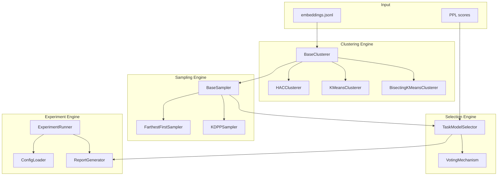

# Design Document: BTMS Pipeline Improvement

## Overview

本设计文档描述 Bug Task Model Selection (BTMS) 流水线的改进方案，包括聚类算法扩展、采样算法改进、多代表投票机制、代码结构重构以及批量实验支持。

核心设计原则：
1. **可扩展性**: 通过抽象基类支持新算法的快速集成
2. **向后兼容**: 保持现有 CLI 接口和输出格式不变
3. **实验友好**: 支持参数网格搜索和批量实验
4. **可追溯性**: 完整记录实验配置和结果

## Architecture



## Components and Interfaces

### 1. Clustering Engine

#### 1.1 BaseClusterer (Abstract Base Class)

```python
from abc import ABC, abstractmethod
from dataclasses import dataclass
from pathlib import Path
import numpy as np

@dataclass
class ClusteringConfig:
    """聚类算法配置"""
    n_clusters: int
    metric: str = "cosine"
    normalize: bool = True
    seed: int = 42
    # 算法特定参数
    extra_params: dict = None

@dataclass
class ClusteringResult:
    """聚类结果"""
    labels: np.ndarray  # shape (n_samples,)
    n_clusters: int
    config: ClusteringConfig
    metadata: dict = None  # 算法特定元数据

class BaseClusterer(ABC):
    """聚类算法抽象基类"""
    
    @property
    @abstractmethod
    def name(self) -> str:
        """算法名称"""
        pass
    
    @abstractmethod
    def fit(self, vectors: np.ndarray) -> ClusteringResult:
        """执行聚类
        
        Args:
            vectors: (N, D) 向量矩阵
            
        Returns:
            ClusteringResult 包含聚类标签和元数据
        """
        pass
    
    def export_assignments(
        self, 
        result: ClusteringResult, 
        ids: list[str], 
        out_path: Path
    ) -> None:
        """导出 assignments.jsonl"""
        with out_path.open("w", encoding="utf-8") as f:
            for item_id, label in zip(ids, result.labels):
                f.write(json.dumps({
                    "item_id": item_id, 
                    "cluster_id": int(label)
                }) + "\n")
```

#### 1.2 KMeansClusterer

```python
class KMeansClusterer(BaseClusterer):
    """KMeans 聚类实现"""
    
    def __init__(self, config: ClusteringConfig):
        self.config = config
        self.max_iter = config.extra_params.get("max_iter", 300)
    
    @property
    def name(self) -> str:
        return "kmeans"
    
    def fit(self, vectors: np.ndarray) -> ClusteringResult:
        from sklearn.cluster import KMeans
        
        if self.config.normalize and self.config.metric == "cosine":
            vectors = self._l2_normalize(vectors)
        
        model = KMeans(
            n_clusters=self.config.n_clusters,
            max_iter=self.max_iter,
            random_state=self.config.seed,
            n_init=10
        )
        labels = model.fit_predict(vectors)
        
        return ClusteringResult(
            labels=labels,
            n_clusters=self.config.n_clusters,
            config=self.config,
            metadata={"centers": model.cluster_centers_, "inertia": model.inertia_}
        )
```

#### 1.3 HACClusterer

```python
class HACClusterer(BaseClusterer):
    """层次凝聚聚类实现，支持多种 linkage"""
    
    def __init__(self, config: ClusteringConfig):
        self.config = config
        self.linkage = config.extra_params.get("linkage", "average")
    
    @property
    def name(self) -> str:
        return f"hac_{self.linkage}"
    
    def fit(self, vectors: np.ndarray) -> ClusteringResult:
        from sklearn.cluster import AgglomerativeClustering
        
        if self.config.normalize and self.config.metric == "cosine":
            vectors = self._l2_normalize(vectors)
        
        # Ward linkage 需要 euclidean metric
        metric = "euclidean" if self.linkage == "ward" else self.config.metric
        
        model = AgglomerativeClustering(
            n_clusters=self.config.n_clusters,
            metric=metric,
            linkage=self.linkage
        )
        labels = model.fit_predict(vectors)
        
        return ClusteringResult(
            labels=labels,
            n_clusters=self.config.n_clusters,
            config=self.config,
            metadata={"linkage": self.linkage}
        )
```

#### 1.4 BisectingKMeansClusterer

```python
class BisectingKMeansClusterer(BaseClusterer):
    """二分 KMeans 聚类实现"""
    
    def __init__(self, config: ClusteringConfig):
        self.config = config
        self.bisecting_strategy = config.extra_params.get("bisecting_strategy", "largest_cluster")
    
    @property
    def name(self) -> str:
        return "bisecting_kmeans"
    
    def fit(self, vectors: np.ndarray) -> ClusteringResult:
        from sklearn.cluster import BisectingKMeans
        
        if self.config.normalize and self.config.metric == "cosine":
            vectors = self._l2_normalize(vectors)
        
        model = BisectingKMeans(
            n_clusters=self.config.n_clusters,
            random_state=self.config.seed,
            bisecting_strategy=self.bisecting_strategy
        )
        labels = model.fit_predict(vectors)
        
        return ClusteringResult(
            labels=labels,
            n_clusters=self.config.n_clusters,
            config=self.config,
            metadata={"centers": model.cluster_centers_}
        )
```

#### 1.5 ClustererFactory

```python
class ClustererFactory:
    """聚类器工厂"""
    
    _registry: dict[str, type[BaseClusterer]] = {
        "kmeans": KMeansClusterer,
        "hac_average": HACClusterer,
        "hac_ward": HACClusterer,
        "bisecting_kmeans": BisectingKMeansClusterer,
    }
    
    @classmethod
    def create(cls, algorithm: str, config: ClusteringConfig) -> BaseClusterer:
        if algorithm not in cls._registry:
            raise ValueError(f"Unknown algorithm: {algorithm}. Available: {list(cls._registry.keys())}")
        
        # 为 HAC 设置 linkage
        if algorithm.startswith("hac_"):
            linkage = algorithm.split("_", 1)[1]
            config.extra_params = config.extra_params or {}
            config.extra_params["linkage"] = linkage
        
        return cls._registry[algorithm](config)
    
    @classmethod
    def register(cls, name: str, clusterer_class: type[BaseClusterer]) -> None:
        cls._registry[name] = clusterer_class
```

### 2. Sampling Engine

#### 2.1 BaseSampler (Abstract Base Class)

```python
@dataclass
class SamplingConfig:
    """采样算法配置"""
    reps_per_cluster: int = 1
    metric: str = "cosine"
    seed: int = 42
    extra_params: dict = None

@dataclass
class SamplingResult:
    """采样结果"""
    representatives: dict[int, list[int]]  # cluster_id -> [global_indices]
    config: SamplingConfig

class BaseSampler(ABC):
    """采样算法抽象基类"""
    
    @property
    @abstractmethod
    def name(self) -> str:
        pass
    
    @abstractmethod
    def sample(
        self, 
        vectors: np.ndarray, 
        cluster_indices: dict[int, np.ndarray]
    ) -> SamplingResult:
        """从每个 cluster 采样代表
        
        Args:
            vectors: (N, D) 全部向量
            cluster_indices: cluster_id -> 该 cluster 的向量索引数组
            
        Returns:
            SamplingResult
        """
        pass
    
    def export_representatives(
        self,
        result: SamplingResult,
        ids: list[str],
        meta: dict,
        out_path: Path
    ) -> None:
        """导出 representatives.jsonl"""
        with out_path.open("w", encoding="utf-8") as f:
            for cid, indices in sorted(result.representatives.items()):
                for rank, idx in enumerate(indices, start=1):
                    item_id = ids[idx]
                    f.write(json.dumps({
                        "cluster_id": cid,
                        "rank": rank,
                        "item_id": item_id,
                        **self._meta_to_dict(meta.get(item_id))
                    }) + "\n")
```

#### 2.2 FarthestFirstSampler

```python
class FarthestFirstSampler(BaseSampler):
    """Farthest-First 采样实现"""
    
    def __init__(self, config: SamplingConfig):
        self.config = config
    
    @property
    def name(self) -> str:
        return "farthest_first"
    
    def sample(
        self, 
        vectors: np.ndarray, 
        cluster_indices: dict[int, np.ndarray]
    ) -> SamplingResult:
        representatives = {}
        
        for cid, indices in cluster_indices.items():
            if len(indices) == 0:
                continue
            
            # 选择 medoid 作为起点
            medoid = self._select_medoid(vectors, indices)
            
            # Farthest-first 选择剩余代表
            chosen = self._farthest_first(
                vectors, indices, 
                start_index=medoid,
                k=self.config.reps_per_cluster
            )
            representatives[cid] = chosen
        
        return SamplingResult(representatives=representatives, config=self.config)
```

#### 2.3 KDPPSampler

```python
class KDPPSampler(BaseSampler):
    """k-DPP 采样实现"""
    
    def __init__(self, config: SamplingConfig):
        self.config = config
    
    @property
    def name(self) -> str:
        return "kdpp"
    
    def sample(
        self, 
        vectors: np.ndarray, 
        cluster_indices: dict[int, np.ndarray]
    ) -> SamplingResult:
        representatives = {}
        
        for cid, indices in cluster_indices.items():
            if len(indices) == 0:
                continue
            
            sub_vectors = vectors[indices]
            cluster_seed = self.config.seed * 1000003 + cid
            
            # Greedy DPP 选择
            local_indices = self._greedy_dpp_order(
                sub_vectors, 
                max_items=self.config.reps_per_cluster,
                seed=cluster_seed
            )
            
            representatives[cid] = [int(indices[i]) for i in local_indices]
        
        return SamplingResult(representatives=representatives, config=self.config)
    
    def _greedy_dpp_order(self, X: np.ndarray, max_items: int, seed: int) -> list[int]:
        """Greedy DPP 采样算法
        
        基于 Cholesky 分解的贪心 DPP 采样，最大化行列式
        """
        # 实现与现有 cluster_representatives.py 中的 _greedy_dpp_order 相同
        pass
```

#### 2.4 SamplerFactory

```python
class SamplerFactory:
    """采样器工厂"""
    
    _registry: dict[str, type[BaseSampler]] = {
        "farthest_first": FarthestFirstSampler,
        "kdpp": KDPPSampler,
    }
    
    @classmethod
    def create(cls, method: str, config: SamplingConfig) -> BaseSampler:
        if method not in cls._registry:
            raise ValueError(f"Unknown method: {method}. Available: {list(cls._registry.keys())}")
        return cls._registry[method](config)
```

### 3. Selection Engine

#### 3.1 VotingMechanism

```python
@dataclass
class VoteResult:
    """投票结果"""
    chosen: str
    votes: dict[str, int]
    mean_scores: dict[str, float]
    n_reps_used: int
    vote_details: list[dict]  # 每个代表的投票详情

class VotingMechanism:
    """多代表投票机制"""
    
    def __init__(self, strategy: str = "majority"):
        """
        Args:
            strategy: 投票策略
                - "majority": 多数投票，平局时用 mean PPL 打破
                - "mean_ppl": 直接用 mean PPL 决定
                - "weighted": 按距离加权投票
        """
        self.strategy = strategy
    
    def vote(
        self, 
        rep_scores: list[dict[str, float]],
        names: list[str]
    ) -> VoteResult:
        """执行投票
        
        Args:
            rep_scores: 每个代表的 PPL 分数 [{name: score, ...}, ...]
            names: 候选策略名称列表
            
        Returns:
            VoteResult
        """
        votes = {n: 0 for n in names}
        score_lists = {n: [] for n in names}
        vote_details = []
        
        for rep_score in rep_scores:
            best_name = None
            best_score = None
            
            for n in names:
                v = rep_score.get(n)
                if v is not None:
                    score_lists[n].append(v)
                    if best_score is None or v < best_score:
                        best_score = v
                        best_name = n
            
            if best_name:
                votes[best_name] += 1
            
            vote_details.append({
                "scores": rep_score,
                "chosen": best_name
            })
        
        # 计算 mean scores
        mean_scores = {
            n: float(np.mean(scores)) if scores else None
            for n, scores in score_lists.items()
        }
        
        # 决定最终选择
        chosen = self._decide(votes, mean_scores, names)
        
        return VoteResult(
            chosen=chosen,
            votes=votes,
            mean_scores=mean_scores,
            n_reps_used=len(rep_scores),
            vote_details=vote_details
        )
    
    def _decide(
        self, 
        votes: dict[str, int], 
        mean_scores: dict[str, float],
        names: list[str]
    ) -> str:
        """根据策略决定最终选择"""
        if self.strategy == "majority":
            max_votes = max(votes.values())
            candidates = [n for n, c in votes.items() if c == max_votes]
            
            if len(candidates) == 1:
                return candidates[0]
            
            # 平局时用 mean PPL 打破
            scored = [(n, mean_scores.get(n)) for n in candidates]
            scored_present = [(n, v) for n, v in scored if v is not None]
            if scored_present:
                return min(scored_present, key=lambda x: x[1])[0]
            return sorted(names)[0]
        
        elif self.strategy == "mean_ppl":
            scored = [(n, v) for n, v in mean_scores.items() if v is not None]
            if scored:
                return min(scored, key=lambda x: x[1])[0]
            return sorted(names)[0]
        
        else:
            raise ValueError(f"Unknown strategy: {self.strategy}")
```

#### 3.2 TaskModelSelector (Updated)

```python
class TaskModelSelector:
    """任务模型选择器（支持多代表投票）"""
    
    def __init__(self, voting_strategy: str = "majority"):
        self.voting = VotingMechanism(strategy=voting_strategy)
    
    def select(
        self,
        representatives_path: Path,
        ppl_by_name: dict[str, dict[str, float]],
        out_dir: Path
    ) -> None:
        """执行选择
        
        支持多代表投票：
        - 读取所有 rank 的代表（不仅仅是 rank=1）
        - 对每个 cluster 的所有代表进行投票
        """
        clusters = self._load_representatives(representatives_path)
        names = list(ppl_by_name.keys())
        
        cluster_choices = {}
        
        for cid, reps in clusters.items():
            # 收集所有代表的 PPL 分数
            rep_scores = []
            for rep in reps:
                slug = rep.get("slug")
                scores = {n: ppl_by_name[n].get(slug) for n in names}
                rep_scores.append(scores)
            
            # 投票
            result = self.voting.vote(rep_scores, names)
            
            cluster_choices[str(cid)] = {
                "cluster_id": cid,
                "chosen": result.chosen,
                "votes": result.votes,
                "mean_scores": result.mean_scores,
                "n_reps_used": result.n_reps_used,
                "vote_details": result.vote_details
            }
        
        # 输出
        out_dir.mkdir(parents=True, exist_ok=True)
        with (out_dir / "cluster_choices.json").open("w") as f:
            json.dump(cluster_choices, f, indent=2)
    
    def _load_representatives(self, path: Path) -> dict[int, list[dict]]:
        """加载所有代表（所有 rank）"""
        clusters = {}
        for obj in self._iter_jsonl(path):
            cid = obj.get("cluster_id")
            if cid is not None:
                clusters.setdefault(int(cid), []).append(obj)
        return clusters
```

### 4. Experiment Engine

#### 4.1 ExperimentConfig

```python
@dataclass
class ExperimentConfig:
    """实验配置"""
    name: str
    
    # 数据路径
    embeddings_path: Path
    ppl_paths: dict[str, Path]
    
    # 参数网格
    views: list[str]
    clustering_algorithms: list[str]
    k_values: list[int]
    sampling_methods: list[str]
    reps_per_cluster_values: list[int]
    
    # 其他配置
    output_dir: Path
    seed: int = 42
    parallel: bool = False
    n_workers: int = 4
    skip_existing: bool = True

def load_experiment_config(path: Path) -> ExperimentConfig:
    """从 YAML 文件加载实验配置"""
    with path.open("r") as f:
        data = yaml.safe_load(f)
    return ExperimentConfig(**data)
```

#### 4.2 ExperimentRunner

```python
class ExperimentRunner:
    """批量实验运行器"""
    
    def __init__(self, config: ExperimentConfig):
        self.config = config
        self.results = []
    
    def run(self) -> None:
        """运行所有实验组合"""
        combinations = self._generate_combinations()
        
        if self.config.parallel:
            self._run_parallel(combinations)
        else:
            self._run_sequential(combinations)
        
        self._generate_report()
    
    def _generate_combinations(self) -> list[dict]:
        """生成参数组合"""
        from itertools import product
        
        combinations = []
        for view, algo, k, method, reps in product(
            self.config.views,
            self.config.clustering_algorithms,
            self.config.k_values,
            self.config.sampling_methods,
            self.config.reps_per_cluster_values
        ):
            combinations.append({
                "view": view,
                "clustering_algorithm": algo,
                "k": k,
                "sampling_method": method,
                "reps_per_cluster": reps
            })
        return combinations
    
    def _run_single(self, params: dict) -> dict:
        """运行单个实验"""
        # 生成输出目录
        out_dir = self._get_output_dir(params)
        
        if self.config.skip_existing and (out_dir / "overall_metrics.json").exists():
            return self._load_existing_result(out_dir)
        
        # 1. 准备向量
        vectors, ids, meta = self._load_vectors(params["view"])
        
        # 2. 聚类
        clusterer = ClustererFactory.create(
            params["clustering_algorithm"],
            ClusteringConfig(n_clusters=params["k"], seed=self.config.seed)
        )
        cluster_result = clusterer.fit(vectors)
        
        # 3. 采样
        sampler = SamplerFactory.create(
            params["sampling_method"],
            SamplingConfig(reps_per_cluster=params["reps_per_cluster"], seed=self.config.seed)
        )
        cluster_indices = self._build_cluster_indices(cluster_result.labels)
        sample_result = sampler.sample(vectors, cluster_indices)
        
        # 4. 选择
        selector = TaskModelSelector()
        # ... 执行选择和评估
        
        # 5. 保存结果
        self._save_result(out_dir, params, cluster_result, sample_result)
        
        return self._compute_metrics(out_dir)
    
    def _get_output_dir(self, params: dict) -> Path:
        """生成一致的输出目录名"""
        name = f"{params['view']}_{params['clustering_algorithm']}_k{params['k']}_{params['sampling_method']}_r{params['reps_per_cluster']}"
        return self.config.output_dir / name
    
    def _generate_report(self) -> None:
        """生成汇总报告"""
        report = {
            "config": asdict(self.config),
            "results": self.results,
            "summary": self._compute_summary()
        }
        
        with (self.config.output_dir / "experiment_report.json").open("w") as f:
            json.dump(report, f, indent=2)
        
        # 生成 CSV 便于分析
        self._export_csv()
```

#### 4.3 实验配置文件示例

```yaml
# experiment_config.yaml
name: "btms_full_sweep"

embeddings_path: "bug_task_model_selection/data/artifacts/embeddings.jsonl"
ppl_paths:
  edit: "bug_task_model_selection/data/ppl/qwen3_coder_edit.jsonl"
  gen: "bug_task_model_selection/data/ppl/qwen3_coder_gen.jsonl"

views:
  - report
  - test
  - error
  - buggy_code
  - buggy_code_obfuscated
  - buggy_code_mixed

clustering_algorithms:
  - kmeans
  - hac_average
  - hac_ward
  - bisecting_kmeans

k_values: [10, 20, 50, 100, 150, 200, 300]

sampling_methods:
  - farthest_first
  - kdpp

reps_per_cluster_values: [1, 3, 5, 7]

output_dir: "bug_task_model_selection/data/experiments"
seed: 42
parallel: true
n_workers: 8
skip_existing: true
```

## Data Models

### 输入数据格式

#### embeddings.jsonl
```json
{"item_id": "Chart_1__buggy_code", "slug": "Chart_1", "view": "buggy_code", "embedding": [0.1, 0.2, ...]}
```

#### PPL scores (*.jsonl)
```json
{"slug": "Chart_1", "value": 2.345}
```

### 输出数据格式

#### assignments.jsonl
```json
{"item_id": "Chart_1__buggy_code", "cluster_id": 5}
```

#### representatives.jsonl
```json
{"cluster_id": 5, "rank": 1, "item_id": "Chart_1__buggy_code", "slug": "Chart_1", "view": "buggy_code"}
{"cluster_id": 5, "rank": 2, "item_id": "Chart_3__buggy_code", "slug": "Chart_3", "view": "buggy_code"}
```

#### cluster_choices.json
```json
{
  "5": {
    "cluster_id": 5,
    "chosen": "edit",
    "votes": {"edit": 2, "gen": 1},
    "mean_scores": {"edit": 2.1, "gen": 2.5},
    "n_reps_used": 3,
    "vote_details": [...]
  }
}
```

#### experiment_report.json
```json
{
  "config": {...},
  "results": [
    {
      "params": {"view": "buggy_code", "clustering_algorithm": "kmeans", "k": 100, ...},
      "metrics": {"win_rate": 0.65, "vs_baseline": 0.09}
    }
  ],
  "summary": {
    "best_config": {...},
    "best_win_rate": 0.72
  }
}
```

## Correctness Properties

*A property is a characteristic or behavior that should hold true across all valid executions of a system—essentially, a formal statement about what the system should do. Properties serve as the bridge between human-readable specifications and machine-verifiable correctness guarantees.*

### Property 1: Clustering Output Format Consistency

*For any* clustering algorithm and any valid input vectors, the output `assignments.jsonl` file SHALL contain one JSON object per line with exactly `item_id` (string) and `cluster_id` (integer) fields, and the number of lines SHALL equal the number of input vectors.

**Validates: Requirements 1.2, 2.5, 3.4, 4.4**

### Property 2: Sampling Output Format Consistency

*For any* sampling algorithm and any valid clustering result, the output `representatives.jsonl` file SHALL contain JSON objects with `cluster_id` (integer), `rank` (integer starting from 1), and `item_id` (string) fields, with ranks being sequential within each cluster.

**Validates: Requirements 5.4, 6.2, 7.4**

### Property 3: Cluster Count Correctness

*For any* clustering algorithm (KMeans, HAC, Bisecting KMeans) and any valid k value where k ≤ n_samples, the clustering result SHALL produce exactly k clusters (or fewer only when n_samples < k).

**Validates: Requirements 2.2, 3.3, 4.2**

### Property 4: Deterministic Results with Fixed Seed

*For any* algorithm (clustering or sampling) with a fixed random seed, executing the algorithm twice on the same input SHALL produce identical results.

**Validates: Requirements 2.4, 7.3**

### Property 5: Representative Count Correctness

*For any* sampling algorithm and any valid `reps_per_cluster` value, each cluster SHALL have at most `reps_per_cluster` representatives, and exactly `reps_per_cluster` when the cluster size is >= `reps_per_cluster`.

**Validates: Requirements 5.2, 6.1, 6.2**

### Property 6: Voting Mechanism Correctness

*For any* set of representative PPL scores:
- When one strategy has strictly more votes, it SHALL be chosen
- When votes are tied, the strategy with lower mean PPL SHALL be chosen
- The output SHALL record the correct vote counts matching the individual representative choices

**Validates: Requirements 8.1, 8.2, 8.3**

### Property 7: Experiment Configuration Uniqueness

*For any* two different parameter combinations in a batch experiment, the generated output directory names SHALL be different, and each output directory SHALL contain a configuration file that exactly matches the parameters used.

**Validates: Requirements 11.4, 12.1, 12.3**

### Property 8: Parameter Grid Expansion Correctness

*For any* experiment configuration with parameter grids, the number of generated experiment combinations SHALL equal the product of all grid sizes (|views| × |algorithms| × |k_values| × |methods| × |reps_values|).

**Validates: Requirements 11.2, 11.3**

### Property 9: Invalid Algorithm Error Handling

*For any* invalid algorithm name provided to the factory, the system SHALL raise a ValueError with a message containing the invalid name and the list of available algorithms.

**Validates: Requirements 10.3**

### Property 10: Incremental Experiment Skip

*For any* experiment configuration with `skip_existing=True`, if an output directory already contains `overall_metrics.json`, re-running the experiment SHALL not modify that directory and SHALL return the existing results.

**Validates: Requirements 12.5**


## Error Handling

### Clustering Engine Errors

| Error Condition | Handling |
|-----------------|----------|
| Invalid algorithm name | Raise `ValueError` with available algorithms list |
| k > n_samples | Raise `ValueError` with message explaining constraint |
| k <= 0 | Raise `ValueError` with message |
| Empty input vectors | Raise `ValueError` with message |
| Inconsistent vector dimensions | Raise `ValueError` with dimension mismatch details |
| Ward linkage with cosine metric | Auto-convert to euclidean with warning |

### Sampling Engine Errors

| Error Condition | Handling |
|-----------------|----------|
| Invalid sampling method | Raise `ValueError` with available methods list |
| reps_per_cluster <= 0 | Raise `ValueError` with message |
| Empty cluster | Skip cluster, log warning |
| Cluster size < reps_per_cluster | Return all items in cluster |

### Selection Engine Errors

| Error Condition | Handling |
|-----------------|----------|
| Missing PPL scores for representative | Skip representative in voting, log warning |
| All representatives missing PPL | Use default choice, log warning |
| Invalid voting strategy | Raise `ValueError` with available strategies |

### Experiment Engine Errors

| Error Condition | Handling |
|-----------------|----------|
| Invalid config file format | Raise `ValueError` with parsing error details |
| Missing required config fields | Raise `ValueError` listing missing fields |
| Output directory not writable | Raise `PermissionError` with path |
| Parallel execution failure | Log error, continue with remaining experiments |

## Testing Strategy

### Unit Tests

Unit tests focus on specific examples and edge cases:

1. **Clustering Tests**
   - Test each algorithm with small synthetic datasets
   - Test edge cases: k=1, k=n_samples, single-point clusters
   - Test configuration parsing and validation

2. **Sampling Tests**
   - Test each method with known cluster structures
   - Test edge cases: single-item clusters, reps_per_cluster > cluster_size
   - Test rank ordering correctness

3. **Voting Tests**
   - Test majority voting with clear winner
   - Test tie-breaking with mean PPL
   - Test edge cases: all same votes, missing scores

4. **Experiment Tests**
   - Test config file parsing
   - Test output directory naming
   - Test incremental run detection

### Property-Based Tests

Property-based tests verify universal properties across many generated inputs using the `hypothesis` library.

**Configuration:**
- Minimum 100 iterations per property test
- Use `hypothesis.settings(max_examples=100)`

**Test Annotations:**
Each property test must include a comment referencing the design property:
```python
# Feature: btms-pipeline-improvement, Property 1: Clustering Output Format Consistency
# Validates: Requirements 1.2, 2.5, 3.4, 4.4
```

**Property Test List:**

1. **Property 1 Test**: Generate random vectors and algorithm choices, verify output format
2. **Property 2 Test**: Generate random clustering results, verify sampling output format
3. **Property 3 Test**: Generate random k values and vectors, verify cluster count
4. **Property 4 Test**: Generate random seeds, verify reproducibility
5. **Property 5 Test**: Generate random reps_per_cluster values, verify representative counts
6. **Property 6 Test**: Generate random PPL scores, verify voting correctness
7. **Property 7 Test**: Generate random parameter combinations, verify directory uniqueness
8. **Property 8 Test**: Generate random grid sizes, verify expansion count
9. **Property 9 Test**: Generate random invalid names, verify error messages
10. **Property 10 Test**: Generate experiments with existing outputs, verify skip behavior

### Integration Tests

Integration tests verify end-to-end pipeline behavior:

1. **Full Pipeline Test**: Run complete pipeline with small dataset
2. **Algorithm Comparison Test**: Verify all algorithms produce valid results on same input
3. **Batch Experiment Test**: Run small batch experiment, verify all outputs generated

## Directory Structure (After Refactoring)

```
bug_task_model_selection/
├── src/
│   └── btms/
│       ├── __init__.py
│       ├── clustering/
│       │   ├── __init__.py
│       │   ├── base.py           # BaseClusterer, ClusteringConfig, ClusteringResult
│       │   ├── kmeans.py         # KMeansClusterer
│       │   ├── hac.py            # HACClusterer (average, ward)
│       │   ├── bisecting.py      # BisectingKMeansClusterer
│       │   └── factory.py        # ClustererFactory
│       ├── sampling/
│       │   ├── __init__.py
│       │   ├── base.py           # BaseSampler, SamplingConfig, SamplingResult
│       │   ├── farthest_first.py # FarthestFirstSampler
│       │   ├── kdpp.py           # KDPPSampler
│       │   └── factory.py        # SamplerFactory
│       ├── selection/
│       │   ├── __init__.py
│       │   ├── voting.py         # VotingMechanism, VoteResult
│       │   └── selector.py       # TaskModelSelector
│       ├── data/
│       │   ├── __init__.py
│       │   ├── loader.py         # 数据加载函数
│       │   └── exporter.py       # 结果导出函数
│       ├── evaluation/
│       │   ├── __init__.py
│       │   └── metrics.py        # 评估指标计算
│       ├── experiment/
│       │   ├── __init__.py
│       │   ├── config.py         # ExperimentConfig
│       │   ├── runner.py         # ExperimentRunner
│       │   └── report.py         # ReportGenerator
│       └── utils/
│           ├── __init__.py
│           ├── io.py             # IO 工具函数
│           └── math.py           # 数学工具函数
├── tests/
│   ├── __init__.py
│   ├── test_clustering.py
│   ├── test_sampling.py
│   ├── test_selection.py
│   ├── test_experiment.py
│   └── properties/
│       ├── __init__.py
│       └── test_properties.py    # Property-based tests
├── scripts/
│   ├── run_experiment.py         # 实验运行脚本
│   └── analyze_results.py        # 结果分析脚本
└── configs/
    └── experiment_template.yaml  # 实验配置模板
```

## Migration Plan

为保持向后兼容，迁移分阶段进行：

### Phase 1: 创建新模块结构
- 创建 `src/btms/` 目录结构
- 实现抽象基类和工厂
- 迁移现有算法到新结构

### Phase 2: 添加新算法
- 实现 KMeans 聚类
- 实现 HAC Ward linkage
- 实现 Bisecting KMeans
- 实现 k-DPP 采样

### Phase 3: 更新选择器
- 实现多代表投票机制
- 更新 TaskModelSelector

### Phase 4: 实验支持
- 实现 ExperimentConfig
- 实现 ExperimentRunner
- 实现报告生成

### Phase 5: CLI 更新
- 添加新的命令行参数
- 保持旧参数向后兼容
- 添加配置文件支持

### Phase 6: 清理
- 标记旧模块为 deprecated
- 更新文档
- 移除冗余代码
